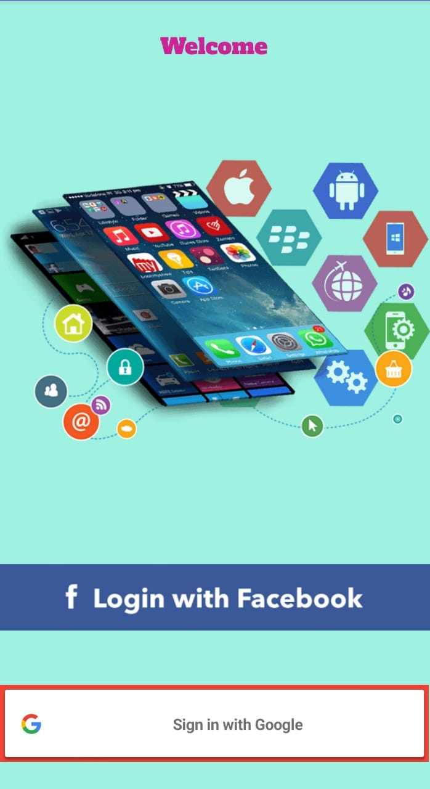
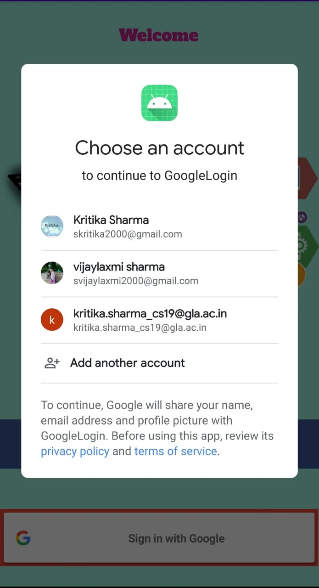

#  Social Media Integration
This project deals with the generation of an android application - Social Media Integration.
It allows the user to login in through their registered accounts and see the information regarding to their account.

Given below are the screenshots of the application:

